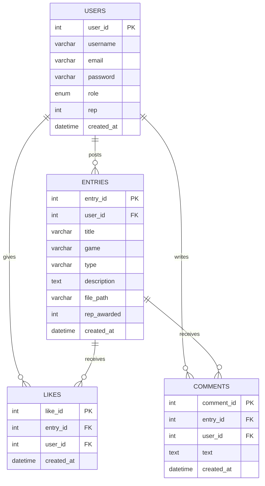

# Hall of Legends

A gaming achievement community — post speedruns, boss kills, and
screenshots, earn reputation, and climb the leaderboard. Built with
PHP, MySQL (mysqli), vanilla JavaScript, and plain CSS.

## Human truth
Some things deserve to be remembered.

## Behavioural twist
Reputation isn't permanent — it's earned through activity.

## Build constraint
No traditional navigation menu — every screen change happens through
a button, pill, or clickable card (see the floating button cluster in
`includes/header.php`).

## Tech stack
- PHP 8 (mysqli, prepared statements throughout)
- MySQL (views, joins, subqueries, window functions)
- Vanilla JavaScript (drag-and-drop upload, delete confirmations)
- Plain CSS (no framework)

## Setup

1. Start Apache and MySQL in XAMPP.
2. Copy this whole folder into `htdocs/hall_of_legends`.
3. Open phpMyAdmin → SQL tab → paste and run `database/hall_of_legends.sql`.
4. Confirm `config/db.php` matches your MySQL credentials (default XAMPP: user `root`, no password).
5. Create an empty `uploads/` folder in the project root if it isn't already there.
6. Visit `http://localhost/hall_of_legends/register.php` to create an account, or log in with a seeded demo account below.

> If you prefer the hyphenated route, a Windows junction alias is available at `C:\xampp\htdocs\hall-of-legends`, and Apache will resolve it to the same project.

## Demo accounts

All seeded accounts use the password: `password`

| Username      | Role  |
|---------------|-------|
| admin_dragon  | admin |
| mika.exe      | user  |
| jrunner_45    | user  |
| 10noblade     | user  |
| coldstreak    | user  |

## Advanced SQL used

- **`entry_feed_view`** — a JOIN (entries + users) combined with a correlated SUBQUERY (live like count).
- **`leaderboard_view`** — a WINDOW FUNCTION (`RANK() OVER (ORDER BY rep DESC)`) to compute live leaderboard position.
- Every query in the app uses prepared statements (`bind_param`) — no raw string interpolation into SQL.

## Role-based access

- `role` column on `users`: `user` or `admin`.
- `moderate.php` is admin-only (`require_admin()`), lets an admin delete any entry or promote/revoke other admins.
- Entry owners (or admins) can edit/delete their own entries via `edit.php` / `delete.php`.

## CRUD coverage

| Action | File |
|---|---|
| Create | `post.php` |
| Read   | `index.php`, `entry.php`, `leaderboard.php` |
| Update | `edit.php`, `promote.php` |
| Delete | `delete.php` |

## ER Diagram

## Demo video

[Add your unlisted YouTube / Drive link here]